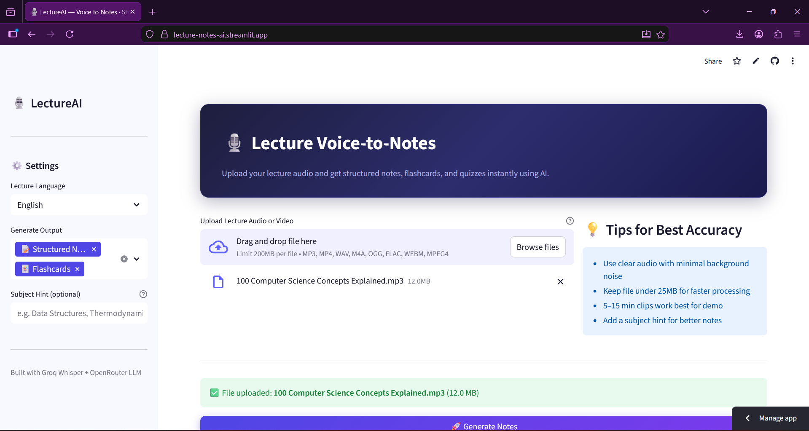

# 🎙️ LectureAI — Voice-to-Notes Generator

> An AI-powered web application that converts lecture audio into structured study materials — notes, flashcards, and glossaries — instantly using state-of-the-art AI models.


---

## 📌 Project Overview

**LectureAI** is an AI/ML internship completion project that addresses a real problem faced by students — the inability to take accurate, comprehensive notes while simultaneously listening to lectures.

The application uses a two-stage AI pipeline:
1. **Groq Whisper Large v3** transcribes uploaded audio with high accuracy and speed
2. **OpenRouter LLMs** (Llama 3.3 70B, Gemma 3 27B) process the transcript to generate structured notes, flashcards, and glossaries

Built entirely with free-tier APIs making it accessible and deployable by anyone.

---

## 🌐 Live Demo

Try the deployed application here:

👉 https://lecture-notes-ai.streamlit.app/
---

## 🎯 Problem Statement

Students frequently miss key points during lectures because it is difficult to listen and write notes simultaneously. Existing solutions require expensive software or technical expertise. LectureAI provides an intelligent, easy-to-use platform that automates the entire note-taking process using generative AI.

---
## 📸 Screenshot

## ✨ Features

| Feature | Description |
|--------|-------------|
| 🎙️ Audio Transcription | Upload MP3, MP4, WAV, M4A, OGG, FLAC, WEBM files up to 200MB |
| 📝 Structured Notes | AI-generated clean notes with headings, key concepts, and summary |
| 🃏 Flashcards | Auto-generated Q&A flashcard pairs for active recall |
| 📋 MCQ Quiz | Multiple choice questions with instant scoring |
| 📖 Glossary | Key terms and definitions extracted from the lecture |
| 📄 PDF Export | Download all generated content as a formatted PDF |
| 🌍 Multi-language | Supports English, Hindi, Spanish, French, German and more |
| ⚡ Fast Processing | Groq's ultra-fast inference processes audio in seconds |

---

## 🧠 Tech Stack

| Component | Technology |
|-----------|-----------|
| Frontend | Streamlit |
| Speech-to-Text | Groq Whisper Large v3 |
| Note Generation | OpenRouter (Llama 3.3 70B / Gemma 3 27B) |
| PDF Export | fpdf2 |
| Language | Python 3.11 |
| Deployment | Streamlit Cloud |

---

## 🏗️ Architecture

```
User uploads Audio File
        ↓
Groq Whisper Large v3
(Speech-to-Text Transcription)
        ↓
Raw Transcript Text
        ↓
OpenRouter LLM (Llama 3.3 70B)
        ↓
┌───────────────────────────────┐
│  Structured Notes             │
│  Flashcards (Q&A pairs)       │
│  MCQ Quiz with scoring        │
│  Key Terms Glossary           │
└───────────────────────────────┘
        ↓
Streamlit UI + PDF Export
```

---

## 📁 Project Structure

```
lecture_notes_app/
│
├── app.py                        # Main Streamlit application
│
├── utils/
│   ├── __init__.py
│   ├── transcriber.py            # Groq Whisper audio transcription
│   ├── audio_processor.py        # Audio file preprocessing
│   ├── notes_generator.py        # OpenRouter LLM note generation
│   └── pdf_exporter.py           # PDF generation with fpdf2
│
├── assets/
│   └── style.css                 # Custom UI styling
│
├── .streamlit/
│   └── config.toml               # Streamlit theme configuration
│
├── .env.example                  # Environment variables template
├── requirements.txt              # Python dependencies
└── README.md
```

---

## ⚙️ Setup & Installation

### Prerequisites
- Python 3.11
- pip

### 1. Clone the Repository

```bash
git clone https://github.com/yourusername/lecture_notes_app.git
cd lecture_notes_app
```

### 2. Create Virtual Environment

```bash
python -m venv .venv
.venv\Scripts\activate        # Windows
source .venv/bin/activate     # Mac/Linux
```

### 3. Install Dependencies

```bash
pip install -r requirements.txt
```

### 4. Set Up API Keys

Copy the example env file and fill in your keys:

```bash
cp .env.example .env
```

Edit `.env`:
```
GROQ_API_KEY=your_groq_api_key_here
OPENROUTER_API_KEY=your_openrouter_api_key_here
```

### 5. Run the App

```bash
streamlit run app.py
```

Open your browser at `http://localhost:8501`

---

## 🔑 Getting Free API Keys

| Service | Link | Cost |
|---------|------|------|
| Groq (Whisper) | https://console.groq.com | Free tier |
| OpenRouter (LLM) | https://openrouter.ai | Free models available |

---

## 🚀 Deploying to Streamlit Cloud

1. Push your project to a **public GitHub repository**
2. Go to [https://share.streamlit.io](https://share.streamlit.io)
3. Click **New app** and connect your GitHub repo
4. Set the main file path to `app.py`
5. Go to **Advanced settings → Secrets** and add:

```toml
GROQ_API_KEY = "your_groq_key"
OPENROUTER_API_KEY = "your_openrouter_key"
```

6. Click **Deploy** — your app will be live in 2-3 minutes!

> **Important:** Never push your `.env` file to GitHub. Add it to `.gitignore`.

---

## 📦 Requirements

```
streamlit>=1.35.0
groq>=0.9.0
requests>=2.31.0
python-dotenv>=1.0.0
fpdf2>=2.7.9
audioop-lts>=0.2.1
```

---

## 💡 How to Use

1. Open the app in your browser
2. Select your lecture language from the sidebar
3. Choose which outputs to generate (Notes, Flashcards, Glossary)
4. Optionally add a subject hint (e.g. "Data Structures") for better results
5. Upload your lecture audio file (MP3, WAV, M4A, etc.)
6. Click **Generate Notes**
7. View results across tabs and download as PDF

---

## 📊 Model Performance

| Audio Length | Transcription Time | Notes Generation |
|-------------|-------------------|-----------------|
| 1-3 minutes | ~3-5 seconds | ~10-15 seconds |
| 3-10 minutes | ~5-15 seconds | ~15-25 seconds |
| 10-20 minutes | ~15-30 seconds | ~20-40 seconds |

*Transcription powered by Groq's ultra-fast inference infrastructure*

---

## 🔒 Privacy & Security

- Audio files are processed in memory and never stored permanently
- API keys are stored securely in environment variables
- No user data is saved between sessions
- All processing happens server-side via secure HTTPS API calls

---

## 🛠️ Future Enhancements

- YouTube URL support for direct lecture video processing
- Chat with your lecture using RAG (Retrieval Augmented Generation)
- Speaker diarization to separate professor and student voices
- Topic timeline showing what was covered at each timestamp
- Spaced repetition revision scheduler
- Multi-language note translation

---

## 👨‍💻 Developer

**Developed as an IBM SkillsBuild AI/ML Internship Completion Project**

- Built with Python, Streamlit, Groq, and OpenRouter
- Uses state-of-the-art open source LLMs via free APIs
- Designed for real-world student use cases

---

## 📄 License

This project is licensed under the MIT License.

---

## 🙏 Acknowledgements

- [Groq](https://groq.com) for ultra-fast Whisper inference
- [OpenRouter](https://openrouter.ai) for free LLM access
- [Streamlit](https://streamlit.io) for the rapid web app framework
- [Meta AI](https://ai.meta.com) for the Llama 3.3 model
- [Google DeepMind](https://deepmind.google) for the Gemma 3 model
- IBM SkillsBuild for the internship opportunity

---

*Made with love for students who deserve better study tools*
